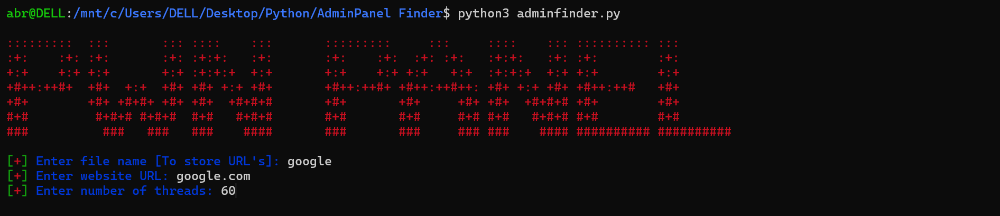
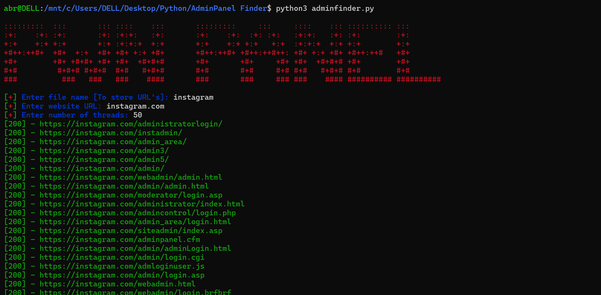
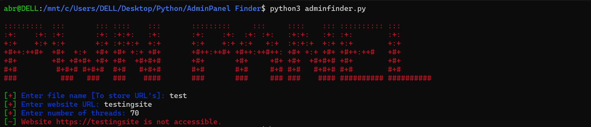

# Admin Panel Finder

A Python script that checks for the existence of admin panels on websites using user-defined paths. The script leverages threading for efficient URL checking and randomizes user agents to mimic real browser requests.

## Features

- **Multi-threaded**: Speeds up the process by using multiple threads to check URLs concurrently.
- **Random User Agents**: Utilizes the `fake_useragent` library to generate random User-Agent strings for each request.
- **Color-coded Output**: Provides clear visual feedback in the terminal with color-coded responses.

## Requirements

- Python 3.x
- `requests`
- `fake_useragent`

## Installation

To install the required packages, run:

```bash
pip install requests fake-useragent
```

## Usage

```bash
python adminfinder.py
```

## Screenshots

Here are some screenshots of the Admin Panel Finder in action:

### Screenshot 1


### Screenshot 2


### Screenshot 3


## Warning

This script is intended for educational and ethical testing purposes only. The author is not responsible for any misuse or illegal activities that may arise from its use. Ensure you have permission to scan the website, as unauthorized scanning may violate terms of service or local laws.